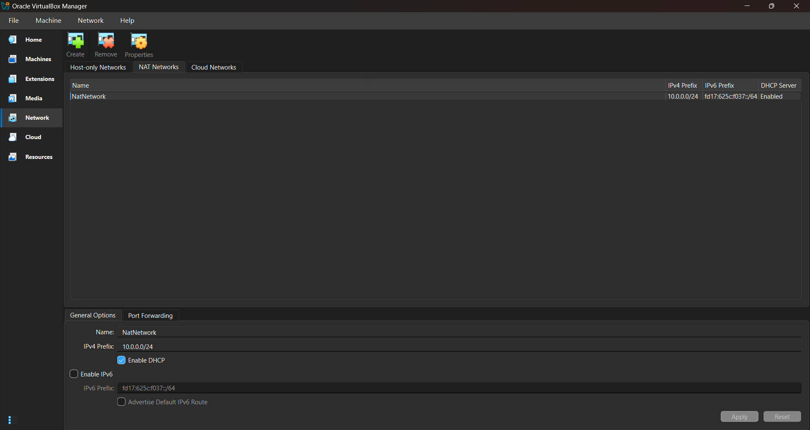
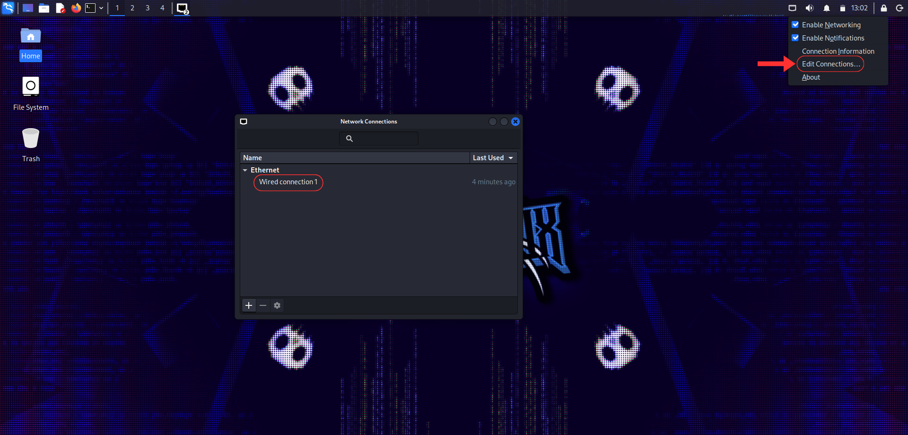

<div align="center">

# 🔐 Cybersecurity Lab Environment Setup

**Building an isolated virtual lab for penetration testing and ethical hacking practice**

<p>
  
  
  
  
  
  
  
  
</p>

</div>

---

## 📌 Project Overview

This project documents the setup of a **virtual cybersecurity and penetration-testing laboratory** built with VirtualBox and Kali Linux, completed as part of my cybersecurity internship.

The goal is a controlled, isolated environment where network scanning, reconnaissance, vulnerability assessment, and other security-testing activities can be practiced safely and repeatedly — without touching any production system.

The lab runs on a private virtual network so additional target machines can be added later for further exercises.

---

## 🎯 Objectives

- Install and configure VirtualBox.
- Import Kali Linux as a virtual machine.
- Create a private **NAT Network** dedicated to the lab.
- Configure network connectivity for the Kali VM.
- Assign a consistent, static IP address to Kali.
- Verify connectivity and DNS resolution.
- Take a clean VM snapshot for recovery.
- Document the full setup process, including issues and fixes.
- Prepare the environment for future cybersecurity projects.

---

## 🛡️ Purpose of the Lab

This lab provides an isolated, controlled environment for cybersecurity learning and authorized security testing, including:

- Network reconnaissance
- Port scanning
- Vulnerability assessment
- Packet analysis
- Web security testing
- Exploitation practice
- Security-tool experimentation

> ⚠️ **Important:** This laboratory must only be used against systems you own or have explicit permission to test. Never use it against unauthorized systems.

---

## 🏗️ Lab Architecture

<p align="center">
  
</p>

Additional target machines can be added to the same virtual network in future projects.

---

## ⚙️ Lab Configuration

| 🧩 Component       | ⚙️ Configuration    |
| ------------------ | -------------------- |
| 🖥️ Host OS         | Windows 10            |
| 🧠 Host RAM        | 8 GB                  |
| ⚡ Processor       | Intel Core i7          |
| 🧰 Hypervisor      | VirtualBox 7.2        |
| 🐉 Security OS     | Kali Linux 2026.2     |
| 🧠 Kali RAM        | 2048 MB               |
| 🌐 Virtual Network | NAT Network           |
| 📡 Network Address | 10.0.0.0/24           |
| 🐧 Kali IP Address | 10.0.0.2/24           |
| 🚪 Default Gateway | 10.0.0.1              |
| 🌍 DNS Server      | 8.8.8.8               |
| 🔮 Future VM Range | 10.0.0.3 – 10.0.0.99  |

---

## 🪜 Lab Setup Procedure

### Step 1 — Install 7-Zip

7-Zip was installed to extract the Kali Linux VM package, which is distributed as a `.7z` archive.

**Tool:** 7-Zip

---

### Step 2 — Install VirtualBox

VirtualBox was installed as the hypervisor for the lab.

---

### Step 3 — Create the NAT Network

A dedicated NAT Network was created in VirtualBox:

```text
Network Name: NatNetwork
IPv4 Prefix:  10.0.0.0/24
DHCP:         Enabled
IPv6:         Disabled
```

<p align="center">
  
</p>

A **NAT Network** was chosen because multiple VMs attached to it can communicate with one another while still having outbound internet connectivity — allowing future attacker and target VMs to interact within the lab.

---

### Step 4 — Import Kali Linux & Configure Networking

With the NAT Network in place, the Kali Linux VM was downloaded from the official Kali website and imported into VirtualBox, then attached to the NAT Network.

<p align="center">
  
</p>

```text
Adapter 1
Attached to:   NAT Network
Network:       NatNetwork
Adapter Type:  Intel PRO/1000 MT Desktop
RAM:           2048 MB
```

```text
IP Address:  10.0.0.2
Subnet Mask: 255.255.255.0
Gateway:     10.0.0.1
DNS:         8.8.8.8
```

A shared folder was also configured for transferring files between host and Kali VM, and a consistent IP address was set for easier documentation and reference in future exercises.

<p align="center">
  
</p>

<p align="center">
  
</p>

---

### Step 5 — Create a Clean VM Snapshot

After configuration, a VirtualBox snapshot was created as a recovery baseline:

```text
Snapshot Name: Clean Kali - Network Setup
```

If a future exercise damages the VM, it can be restored to this clean state.

---

## 🔎 Lab Verification

| ✅ Test                        | 🧾 Command                        | 🎯 Expected Result               |
| ------------------------------ | ---------------------------------- | --------------------------------- |
| 🌐 Check IP address            | `ip a`                              | Correct Kali IP displayed         |
| 📡 Test gateway                | `ping 10.0.0.1`                     | Successful replies                |
| 🌍 Test internet connectivity  | `ping 8.8.8.8`                      | Successful replies                |
| 🔎 Test DNS resolution         | `nslookup networkwalks.com`         | Domain resolves                   |
| 🧰 Verify Nmap                 | `nmap --version`                    | Nmap version displayed            |
| 🔄 Verify snapshot             | Restore snapshot, run `ip a`        | Baseline configuration restored   |

**Example results:**

```text
IP Address: 10.0.0.2/24
Gateway:    10.0.0.1
DNS:        8.8.8.8
```

---

## 🐞 Problems Encountered & Solutions

### Problem 1 — Internet Connectivity After Static IP Configuration

After manually configuring the IPv4 settings, internet connectivity failed due to the NetworkManager configuration.

**Fix:**

```bash
sudo nmcli connection modify "Wired connection 1" ipv4.dad-timeout 0
```

The connection was then restarted and connectivity re-tested.

> **Note:** Interface/connection names differ between systems — check your actual connection name before running an `nmcli` command.

---

### Problem 2 — VirtualBox VT-x / Virtualization Error

The VM failed to start because hardware virtualization was disabled in the system firmware.

**Fix:**

1. Restart the computer and enter BIOS/UEFI.
2. Enable Intel VT-x / hardware virtualization.
3. Save and restart.
4. Start the Kali VM again.

The VM started successfully once virtualization was enabled.

---

### Problem 3 — Storage Controller Not Supported by Host

The Kali VM's virtual disk was initially attached directly using VirtualBox's default storage configuration, but it wouldn't run properly on this host — my machine only supports a different storage/controller setup.

**Fix:** Switching the VM's storage controller to the type actually supported by my host (rather than the default one) resolved the issue, and the VM has run normally ever since.

> **Note:** If you hit a similar problem, check **Settings → Storage** in VirtualBox and try an alternate controller type (e.g. SATA vs. IDE) that matches what your host and VirtualBox version support.

---

## 💡 What I Learned

### 1. NAT vs. NAT Network
A NAT Network lets multiple VMs on the same virtual network talk to each other while still providing NAT-based internet access — ideal for a multi-machine lab.

### 2. Virtual Machine Networking
How VirtualBox's virtual adapters connect VMs to different network types, and how that configuration affects machine-to-machine communication.

### 3. Static IP Configuration
How to set and verify IPv4 addressing, subnet masks, gateways, and DNS in Kali Linux.

### 4. VM Snapshots
Always take a clean snapshot **before** risky or experimental work — it's the fastest way back to a known-good state.

### 5. Documentation
Recording commands, configuration, screenshots, problems, and fixes is a core part of professional cybersecurity work.

---

## 🔐 Security & Ethical Use

This laboratory is intended strictly for educational purposes.

---

## 🔗 Tools & Resources

- **7-Zip:** https://7-zip.org/download.html
- **VirtualBox:** https://virtualbox.org/wiki/Downloads
- **Kali Linux:** https://kali.org/get-kali

---

<div align="center">

### 👤 Author

**Muhammed Salih**
Cybersecurity Intern

[](https://linkedin.com/in/muhammed-salih-cv-9a292433a)

</div>
